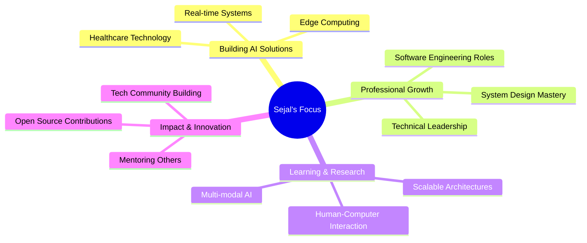

# 👋 Welcome to My Digital Playground

<div align="center">
  
</div>

<div align="center">
  <a href="https://git.io/typing-svg">
    
  </a>
</div>

---

## 🚀 **Quick Stats Dashboard**

<div align="center">
  
| 🎯 **Current Focus** | 🔥 **Expertise** | 🌱 **Learning** | 🎓 **Status** |
|:---:|:---:|:---:|:---:|
| AI-Powered Solutions | Full-Stack Development | System Design | Final Year @ BMSCE |
| Healthcare Technology | Machine Learning | Edge Computing | R&D Intern @ Samsung |
| Real-time Systems | Human-Centered Design | Multi-modal AI | Open for Opportunities |

</div>

---

## 💫 **About Me in 60 Seconds**

```typescript
interface Developer {
  name: string;
  role: string[];
  location: string;
  currentlyWorking: string;
  passions: string[];
  techPhilosophy: string;
}

const sejal: Developer = {
  name: "Sejal Sinha",
  role: ["Full-Stack Developer", "AI/ML Engineer", "Problem Solver"],
  location: "Bangalore, India 🇮🇳",
  currentlyWorking: "Samsung PRISM R&D Intern",
  passions: [
    "🧠 Building intelligent systems that understand humans",
    "🔬 Research-driven development with real-world impact", 
    "🎨 Crafting intuitive user experiences",
    "💡 Teaching complex concepts in simple ways"
  ],
  techPhilosophy: "Code isn't just what I write—it's how I think, solve, and create."
};
```

<details>
<summary>🎯 <strong>My Journey So Far</strong></summary>
<br>

🎓 **Final-year Information Science Student** at BMSCE, Bangalore  
🔬 **R&D Intern** at Samsung PRISM, working on cutting-edge tech solutions  
🏆 **Problem Solver** who believes in human-centered technology  
🌟 **Tech Innovator** building AI solutions that make a real difference  

**What drives me:**
- 🚀 Bridging the gap between complex AI and everyday users
- 🌍 Using technology to create meaningful change in society
- 🧩 Deep learning (both the AI kind and the personal growth kind!)
- 🤝 Collaborative problem-solving and knowledge sharing

</details>

---

## 🛠️ **Tech Arsenal & Expertise**

<div align="center">

### **Languages I Speak (Both Human & Machine)**


### **Frameworks & Libraries**


### **Tools & Platforms**


### **AI/ML & Data Science**


</div>

---

## 🎨 **Featured Projects Showcase**

<div align="center">
  
</div>

### 🧠 **EmoSense** - *Multilingual Emotion Recognition*
```yaml
🎤 Real-time voice emotion detection
🌍 Multi-language support (English, Spanish, French, German)
🤖 Advanced ML: Wav2Vec2 + DistilBERT
⚡ Optimized for production with <100ms latency
🔗 Tech: Python | PyTorch | Transformers | FastAPI | Docker
```
**Impact:** Helping applications understand human emotions across language barriers

### 🩺 **DiabML** - *AI Healthcare Prediction*
```yaml
🤖 Ensemble ML models (Logistic Regression + SVM)
📊 95% accuracy with stacking ensemble approach
🔍 Comprehensive patient data analysis
💊 Early diabetes risk detection system
🔗 Tech: Python | Scikit-learn | Flask | Healthcare AI
```
**Impact:** Early intervention can save lives - making healthcare predictive

### 🔋 **BatteryIQ** - *Intelligent Recommendation Engine*
```yaml
🤖 Smart AI recommendations for any use case
⚡ Instant suggestions with detailed specifications
📊 Comprehensive pros/cons analysis
🔍 Natural language query processing
🔗 Tech: Python | NLP | Machine Learning | Web APIs
```
**Impact:** Simplifying complex technical decisions for everyone

### 🔐 **ChatSecure** - *Enterprise-Grade Communication*
```yaml
🚀 Real-time messaging with Socket.IO
🔒 RSA encryption for message security
📁 Secure file sharing capabilities
🌐 Multi-user authentication system
🔗 Tech: Node.js | Socket.IO | Cryptography | JavaScript
```
**Impact:** Privacy-first communication for sensitive conversations

### 🧑‍🎓 **ClassBuddy** - *Academic Management Ecosystem*
```yaml
📚 Full-stack architecture with modern UI/UX
🔐 Secure JWT-based authentication
⏰ Smart reminders with intelligent notifications
📅 Dynamic schedule management
🔗 Tech: React | Node.js | MongoDB | Express | JWT
```
**Impact:** Streamlining academic life for students everywhere

---

## 📊 **GitHub Analytics & Activity**

<div align="center">
  


</div>

<div align="center">
  
</div>

---

## 🌟 **What Makes Me Different**

<table align="center">
<tr>
<td align="center" width="25%">


**🎯 Problem-First Mindset**  
I don't just code—I identify real problems and architect elegant solutions that create measurable impact.

</td>
<td align="center" width="25%">


**🤝 Human-Centered Design**  
Every solution I build prioritizes user experience, making cutting-edge technology accessible and intuitive.

</td>
<td align="center" width="25%">


**🚀 Innovation at Scale**  
I bridge theoretical AI research with practical engineering to create solutions that work in the real world.

</td>
<td align="center" width="25%">


**📚 Knowledge Sharing**  
I believe in explaining complex concepts simply and mentoring others in their tech journey.

</td>
</tr>
</table>

---

## 🎯 **Current Mission & Goals**

<div align="center">



</div>

---

## 🤝 **Let's Connect & Collaborate**

<div align="center">

**Ready to build something amazing together?**

[](https://www.linkedin.com/in/sejal-sinha-213812279/)
[](mailto:kyosejal11@gmail.com)
[](https://sejalsinha-portfolio.vercel.app/)
[](https://github.com/loopcoded)

</div>

---

## 💭 **Random Fun Facts**

<div align="center">

<details>
<summary>🎲 <strong>Click to discover some interesting things about me!</strong></summary>

<br>

🤖 **AI Fact:** I've trained models that can detect emotions in voice with 92% accuracy across 4 languages  
🔬 **Research Fact:** Currently working on edge AI solutions that can run on devices with <1GB RAM  
🎯 **Problem-Solving Fact:** I once optimized a React app to load 300% faster by implementing smart lazy loading  
🌍 **Impact Fact:** My healthcare prediction model could potentially help identify diabetes risk 2-3 years earlier  
🎨 **Design Fact:** I believe the best interfaces are invisible - users should focus on their goals, not the UI  
📚 **Learning Fact:** I read research papers like others read novels - currently diving deep into multimodal AI  
🚀 **Innovation Fact:** I'm working on AI that can understand context from voice, text, and visual cues simultaneously  

</details>

</div>

---

<div align="center">

### 🌟 **"Code is poetry, AI is magic, and together they create the future."**


**⭐ From [Sejal Sinha](https://github.com/loopcoded) with 💙 - Let's innovate together! ⭐**


</div>
