```mermaid
graph TD
    A[🎯 Current Focus] --> B[Building AI Solutions]
    A --> C[Professional Growth]
    A --> D[Learning & Research]
    A --> E[Impact & Innovation]
    
    B --> B1[🏥 Healthcare Technology]
    B --> B2[⚡ Real-time Systems]  
    B --> B3[🖥️ Edge Computing]
    
    C --> C1[💼 Software Engineering Roles]
    C --> C2[🏗️ System Design Mastery]
    C --> C3[👑 Technical Leadership]
    
    D --> D1[🤖 Multi-modal AI]
    D --> D2[🤝 Human-Computer Interaction]
    D --> D3[📈 Scalable Architectures]
    
    E --> E1[🌟 Open Source Contributions]
    E --> E2[🎓 Mentoring Others]
    E --> E3[🌍 Tech Community Building]
    
    style A fill:#00F5FF,stroke:#ffffff,stroke-width:3px,color:#000000
    style B fill:#FF6B6B,stroke:#ffffff,stroke-width:2px,color:#ffffff
    style C fill:#4ECDC4,stroke:#ffffff,stroke-width:2px,color:#ffffff
    style D fill:#45B7D1,stroke:#ffffff,stroke-width:2px,color:#ffffff
    style E fill:#96CEB4,stroke:#ffffff,stroke-width:2px,color:#ffffff
```

<div align="center">
  
</div>

<div align="center">
  
</div>

<br>

<div align="center">
  
</div>

<br>

<div align="center">
  
</div>

## <div align="center"> **Welcome to My Digital Universe** </div>

<div align="center">
  
</div>

<table align="center">
<tr>
<td align="center" width="33%">


**🎯 Current Focus**
- AI-Powered Solutions
- Healthcare Technology  
- Real-time Systems

</td>
<td align="center" width="33%">


**🔥 Expertise** 
- Full-Stack Development
- Machine Learning
- Human-Centered Design

</td>
<td align="center" width="33%">


**🌱 Learning**
- System Design
- Edge Computing
- Multi-modal AI

</td>
</tr>
</table>

<div align="center">
  
</div>

## <div align="center"> **About Me in Code** </div>

<div align="center">
  
</div>

```typescript
interface SejalSinha extends Developer {
  name: "Sejal Sinha" 🙋‍♀️;
  location: "Bangalore, India 🇮🇳";
  education: "Information Science @ BMSCE" 🎓;
  currentRole: "R&D Intern @ Samsung PRISM" 🏢;
  
  expertise: {
    frontend: ["React ⚛️", "JavaScript 💛", "TypeScript 💙"],
    backend: ["Node.js 🟢", "Python 🐍", "Flask 🌶️"],
    ai_ml: ["TensorFlow 🧠", "PyTorch 🔥", "Scikit-learn 📊"],
    databases: ["MongoDB 🍃", "PostgreSQL 🐘"],
    tools: ["Docker 🐳", "Git 📝", "AWS ☁️"]
  };
  
  superpowers: [
    "🚀 Building AI that actually solves real problems",
    "🎨 Creating intuitive UIs that users love",
    "🔬 Research-driven development approach",
    "💡 Explaining complex tech in simple ways"
  ];
  
  currentMission: "Making AI accessible to everyone" 🌍;
  funFact: "I debug with coffee and solve problems with curiosity!" ☕;
}
```

<div align="center">
  
</div>

## <div align="center"> **Tech Arsenal & Skills** </div>

<div align="center">
  
</div>

<div align="center">

### **💻 Programming Languages**


### **🚀 Frameworks & Libraries**  


### **🗄️ Databases & Cloud**


### **🤖 AI/ML & Data Science**

<br>


### **🛠️ Tools & Platforms**


</div>

<div align="center">
  
</div>

<div align="center">
  
</div>

## <div align="center"> **GitHub Analytics Dashboard** </div>

<div align="center">
  
</div>

<div align="center">
  
  
</div>

<div align="center">
  
</div>

<div align="center">
  
</div>

<div align="center">
  
</div>

<div align="center">
  
</div>

## <div align="center"> **Featured Projects Showcase** </div>

<div align="center">
  
</div>

<table align="center">
<tr>
<td width="50%" valign="top">

### <div align="center">🧠 **EmoSense**</div>
<div align="center">
  
</div>

**🎤 Multilingual Emotion Recognition System**

```yaml
✨ Features:
  - Real-time voice emotion detection
  - Multi-language support (4 languages)
  - 92% accuracy with Wav2Vec2 + DistilBERT
  - <100ms latency optimization

🚀 Tech Stack: Python | PyTorch | Transformers | FastAPI

📊 Impact: Helping apps understand human emotions
```

[](https://github.com/loopcoded/EmoSense-A-REALTIME-MULTILINGUAL-EMOTION-DETECTION)

</td>
<td width="50%" valign="top">

### <div align="center">🩺 **DiabML**</div>
<div align="center">
  
</div>

**🏥 AI-Powered Healthcare Prediction**

```yaml
✨ Features:
  - Ensemble ML models (95% accuracy)
  - Comprehensive patient data analysis
  - Early diabetes risk detection
  - Stacking ensemble approach

🚀 Tech Stack: Python | Scikit-learn | Flask | ML

📊 Impact: Early intervention saves lives
```

[](https://github.com/loopcoded/DiabML--Diabetes-Prediction-Web-App)

</td>
</tr>
<tr>
<td width="50%" valign="top">

### <div align="center">🔋 **BatteryIQ**</div>
<div align="center">
  
</div>

**⚡ Intelligent Recommendation Engine**

```yaml
✨ Features:
  - Smart AI recommendations
  - Instant suggestions with specs
  - Comprehensive pros/cons analysis
  - Natural language processing

🚀 Tech Stack: Python | NLP | ML | Web APIs

📊 Impact: Simplifying tech decisions
```

[](https://github.com/loopcoded/BATTERYIQ)

</td>
<td width="50%" valign="top">

### <div align="center">🔐 **ChatSecure**</div>
<div align="center">
  
</div>

**🛡️ Enterprise-Grade Encrypted Chat**

```yaml
✨ Features:
  - Real-time messaging with Socket.IO
  - RSA encryption for security
  - Secure file sharing
  - Multi-user authentication

🚀 Tech Stack: Node.js | Socket.IO | Crypto | JS

📊 Impact: Privacy-first communication
```

[](https://github.com/loopcoded/ChatSecure)

</td>
</tr>
</table>

<div align="center">

### <div align="center">🧑‍🎓 **ClassBuddy** - *Complete Academic Ecosystem*</div>
<div align="center">
  
</div>

```yaml
✨ Full-Stack Academic Management Platform
📚 Modern UI/UX with React | 🔐 JWT Authentication | ⏰ Smart Reminders | 📅 Dynamic Scheduling
```

[](https://github.com/loopcoded/CLASSBUDDY--Your-Academic-Companion)

</div>

<div align="center">
  
</div>

## <div align="center"> **What Makes Me Unique** </div>

<div align="center">
  
</div>

<table align="center">
<tr>
<td align="center" width="25%">


**🎯 Problem-First**  
I don't just code—I architect solutions that create measurable real-world impact

</td>
<td align="center" width="25%">


**🤝 Human-Centered**  
Every solution prioritizes user experience, making complex tech intuitive and accessible

</td>
<td align="center" width="25%">


**⚡ Innovation Engine**  
I bridge cutting-edge AI research with practical engineering for real-world deployment

</td>
<td align="center" width="25%">


**📚 Knowledge Catalyst**  
I simplify complex concepts and mentor others in their technological journey

</td>
</tr>
</table>

<div align="center">
  
</div>

## <div align="center"> **Current Mission & Goals** </div>

<div align="center">
  
</div>



<div align="center">
  
</div>

## <div align="center"> **Let's Connect & Build Amazing Things** </div>

<div align="center">
  
</div>

<div align="center">

**🚀 Ready to innovate together? Let's connect!**

[](https://www.linkedin.com/in/sejal-sinha-213812279/)
[](mailto:kyosejal11@gmail.com)
[](https://sejalsinha-portfolio.vercel.app/)
[](https://github.com/loopcoded)

</div>

<div align="center">
  
</div>

## <div align="center"> **Fun Facts & Easter Eggs** </div>

<div align="center">
  
</div>

<details>
<summary><b>🎲 Click to discover some interesting things about me!</b></summary>
<br>

<div align="center">
  
</div>

🤖 **AI Fact:** My emotion recognition model can detect subtle voice changes humans miss!  
🔬 **Research Fact:** Currently developing AI that runs on <1GB RAM devices  
🎯 **Optimization Ninja:** Once made a React app 300% faster with smart lazy loading  
🏥 **Healthcare Impact:** My prediction models could identify diabetes risk 2-3 years earlier  
🎨 **Design Philosophy:** The best interfaces are invisible - users focus on goals, not UI  
📚 **Learning Addict:** I read AI research papers like novels - currently obsessed with multimodal AI  
🚀 **Innovation Lab:** Working on AI that understands voice + text + visual cues simultaneously  
☕ **Debug Mode:** I debug with coffee and solve problems with curiosity!  
🌟 **Fun Challenge:** Ask me anything about AI, full-stack dev, or how to explain complex tech simply!

</details>

<div align="center">
  
</div>

<div align="center">

### 

</div>

<div align="center">
  
</div>

<div align="center">

**⭐ From [Sejal Sinha](https://github.com/loopcoded) with 💙 - Let's innovate together! ⭐**


</div>
